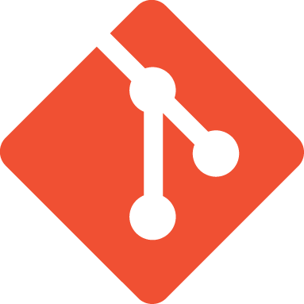
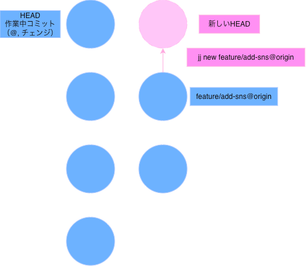
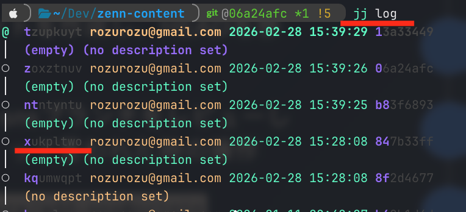
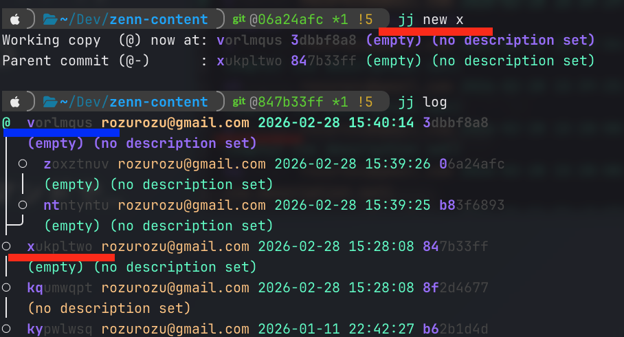
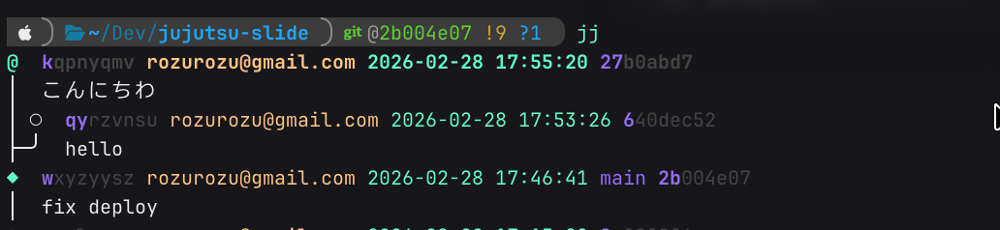
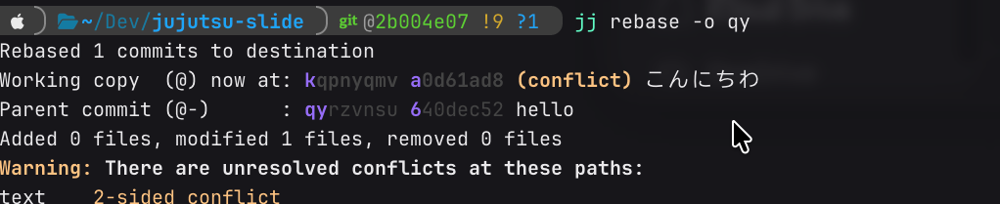
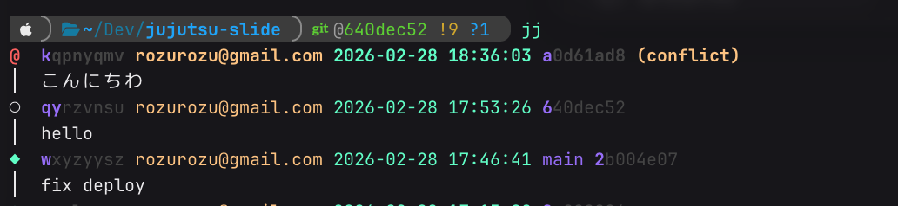
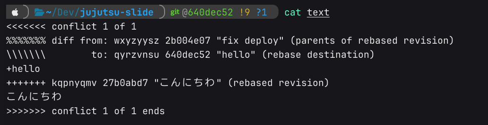
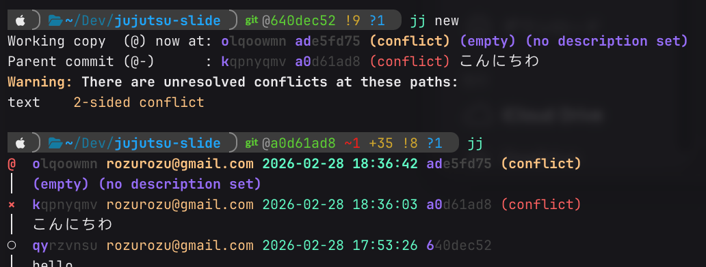

# **jujutsu(jj) の良さみ**

  Created:2026-02-28 
  Updated:2026-02-28 
  v1.0.0
  

    
    @rozurozu
  

---

## **jujutsu(jj) とは** 

git互換のバージョン管理ツール 
 

  
  

---

## **コマンドは `jj`**

`jj`
`jj new`
`jj desc`
`jj b s`
`jj squash`
`jj rebase`
  

### `jj`って打ちやすいし、**イケてる**

---

## **自動保存**

### 変更は常に、最新のコミットに反映される

- **git**：未保存の作業を、明示的に**コミット**という箱へ入れる
- **jj**：最新**コミット**という箱の中で、直接作業をする。

  

### Gitにおける『保存（Commit）』という儀式を、Jujutsuは自動化した

---

## **stash不要**

#### `jj new`コマンド

新たなコミットを作成し、HEADを移す。

feature/add-snsブランチをレビューしてください！って言われた時の操作

`jj new feature/add-sns@origin`

---

## **ブランチが切りやすい！**

`jj log`コマンドで
ツリーが表示される。

チェンジID：xukpltwo

このチェンジから
ブランチ分岐したい時、
`jj new x`コマンドで...

---

xukpltwo
から
vorlmqus
が分岐した！

**ブランチ名も不要！**
**チェンジの指定が簡単！**

---

## **`undo` 最強！！**

一つ前の操作をキャンセル出来る！
例えばrebaseをミスした時

---

### gitの場合

rebaseミスった！
→ `git reflog`でどこまで戻ればいいか確認
→ `git reset --hard HEAD{n}`
    
💡 補足：
`HEAD`じゃなくて`ORIG_HEAD`で操作前を指定できるらしいw

---

### jujutsuの場合

rebaseミスった！

## → `jj undo`

## **これだけ！**

 

💡 補足：
操作を複数戻したい時は`jj undo`しまくればいい！
戻りすぎた時には`jj redo`で、やり直せる！

---

### **コンフリクトしても作業続行**

**こんにちわ** を **hello** にリベース

---

コンフリクトマーカーを持ったままコミットされている

---

`jj new`で作業を続けれる！
コンフリクトは後で解消すれば良い！

---

## **後で綺麗にすればいい**

なんとなく**git**では、毎回のコミットに神経質になる。
`git rebase -i`は便利だけど、コンフリクトの不安は付きまとう。

コーディングエージェントでの開発で、毎回全行レビューはしない。
一旦こんなもんか、でセーブしたい。
こっちの方法だとどうだろうでやり方を分岐させたり。

プッシュする前に綺麗にすればいいじゃない

**チェンジは気軽なセーブポイント**

---

## **まとめ**

- 自動保存！単純明快！
  作業ツリー、インデックス、コミットなんていらない！
- だから、`stash`も不要！
- 最強コマンド！ `jj undo`
- コンフリクトしててもコミット可能！

普段から、過去のコミットの修正や履歴を操作する人にはおすすめ！
コーディングエージェント使う人にもおすすめ！
まだ情報もツールも少ないからgitでいいかもw **学習コスト＞メリット**

---

## **おまけ よく使うコマンド**

- `description`または`desc`
  コミットメッセージを付与する。
- `commit -m`
  `desc` + `new`と同じ。めちゃ使う。
- `bookmark set`または`b s`
  bookmarkを移動させるときに使う。めちゃ使う。
- `squash`
  　めちゃ使うからエイリアス`sq`にしてる
  他にも、`rebase`, `workspace`, `abandon`, `jj git fetch`, `jj git push`

---

## **学習コストは少し高いかも🤯**

- **チェンジ**の概念が少しだけ難しい
- 日本語の情報が少ない
- ツールも少ない
- 公式のcliリファレンスが正確じゃない？らしい
  > This CLI reference is experimental. It is automatically generated, but does not match the jj help output exactly.

https://docs.jj-vcs.dev/latest/cli-reference/#jj-workspace
